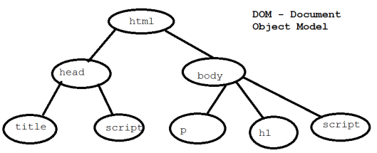

- JavaScript was developed by Brendan Eich, a developer at Netscape Communications Corporation, in 1995
- JS is a scripting language used for client-side validations in web pages
- Interpreted Language

### JavaScript in HTML
- Can be embedded in HTML files, executed when a web page loads or an event triggers
- Scripts can be placed in the head or body sections of HTML
```JS
<script type="text/javascript">
	document.write("Welcome to Javascript")
</script>
```

### Variables
- Information is stored in variables, which can change during script execution
- Declared implicitly (directly using the name) or explicitly (using the `var` keyword)

### Popup Boxes
- **Alert :** Displays a message
```JS
<script type="text/javascript">
	alert("Beware of pickpocketers");
</script>
```
- **Confirm :** Asks the user to confirm something
```JS
<script type="text/javascript">
	if (confirm(" Are you awake ?")==1)
		document.write("Good for you");
	else
		document.write("Bad for you");
</script>
```
- **Prompt :** Asks the user for input
```JS
<script type="text/javascript">
	var name = prompt(" Enter your name“ );
	document.write(name + ", Welcome to JavaScript !");
</script>
```

### Function
- Defined using the `function` keyword
- Function Overloading is not supported
- `prototype` keyword is used to over-ride the functions already existing in JavaScript
- Can be placed both in the body and in the head section
```JS
<script type="text/javascript">
	function disp(){
		alert("This is a function in JavaScript");
	}
</script>
```

### DOM (Document Object Model)
- Represents the structure of a web page
- The document object is a container for all the tags in a HTML page
- Allows scripts to dynamically access and update the content, structure, and style of a document
- It organizes the entire html document in a tree structure


- Some document object methods
	- write() : used to print contents onto a web page
	- getElementById : used to retrieve element with a specific id
	- getElementsByTagName : used to retrieve an array of all elements having a specific tagname

### Built-in Objects
#### 01 String
```JS
let str = "Hello, World!";
console.log(str.length);                      // 13
str.charAt(0)                                 // H
str.concat(" Welcome!")                       // Hello, World! Welcome!
str.includes("World")                         // true
str.indexOf("World")                          // 7
str.toUpperCase()                             // HELLO, WORLD!
str.toLowerCase()                             // hello, world!
str.slice(0, 5)                               // Hello
str.replace("World","Universe")               // Hello, Universe! Welcome!
str.split(" ")                                // ['Hello,','Universe','Welcome!']
str.endsWith("i")                             // false
str.bold()
str.big()
str.fontcolor("color-name")
```
#### 02 Math
```JS
Math.abs(-5)                                  // 5
Math.ceil(4.2)                                // 5
Math.floor(4.8)                               // 4
Math.max(1, 2, 3)                             // 3
Math.min(1, 2, 3)                             // 1
Math.random()                                 // Random number between 0 and 1
Math.round(4.5)                               // 5
Math.sqrt(16)                                 // 4
Math.pow(2, 3)                                // 8
```
#### 03 Date
```JS
// var myDate = new Date()
let date = new Date();
Date.now());                                  // Current timestamp
date.getFullYear()                            // Current year
date.getMonth()                               // Current month
date.getDate()                                // Current day
date.getDay()                                 // Current weekday
date.getHours()                               // Current hour
date.getMinutes()                             // Current minute
date.getSeconds()                             // Current second

date.setFullYear(2025)
date.getFullYear()                            // 2025
date.setMonth(11)                             // December
date.getMonth()                               // 11
date.setDate(25)
date.getDate()                                // 25
```
#### 04 Array
```JS
// var myArray = new Array()
let arr = [1, 2, 3, 4, 5];
arr.length                                    // 5
arr.push(6)                                   // [1, 2, 3, 4, 5, 6]
arr.pop()                                     // [1, 2, 3, 4, 5]
arr.shift();                                  // [2, 3, 4, 5]
arr.unshift(1);                               // [1, 2, 3, 4, 5]
arr.slice(1, 3)                               // [2, 3]
arr.indexOf(3)                                // 2
let newArr = arr.concat([6, 7, 8])            // [1, 2, 3, 4, 5, 6, 7, 8]
arr.forEach((num) => console.log(num * 2));   // 2, 4, 6, 8, 10
let squaredArr = arr.map((num) => num * num); // [1, 4, 9, 16, 25]
```